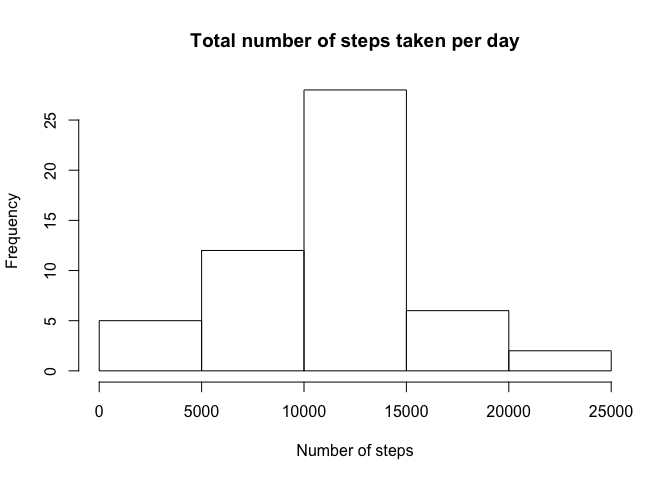

# Reproducible Research: Peer Assessment 1


## Loading and preprocessing the data

Unzip the dataset if it hasn't been done yet, and load it into R. Remove the  
observations that don't have a 'steps' value as they are worthless in this analysis.


```r
if(!file.exists('activity.csv')){
    unzip('activity.zip')
}

steps <- read.csv('activity.csv')
steps$date <- as.Date(steps$date, "%Y-%m-%d")
stepsClean <- subset(steps, !is.na(steps))
```


## What is mean total number of steps taken per day?

Group the data by day and calculate the sum of steps per day, then plot a histogram.


```r
library(dplyr)

stepsPerDay <- stepsClean %>% group_by(date) %>% summarise(sum(steps))
names(stepsPerDay) <- c('date', 'total_steps')
hist(stepsPerDay$total_steps, main = 'Total number of steps taken per day', xlab = 'Number of steps')
```

<!-- -->

Calculate the mean steps taken per day:


```r
mean(stepsPerDay$total_steps)
```

```
## [1] 10766.19
```

And the median steps taken per day:


```r
median(stepsPerDay$total_steps)
```

```
## [1] 10765
```

## What is the average daily activity pattern?

Group the steps taken by 'interval' and average over all days, then make a time series plot.


```r
library(ggplot2)

avgStepsPerInterval <- stepsClean %>% group_by(interval) %>% summarise(mean(steps))
names(avgStepsPerInterval) <- c('interval', 'avg_steps')

qplot(avgStepsPerInterval$interval, avgStepsPerInterval$avg_steps, 
      geom = 'line',
      xlab = 'Interval',
      ylab = 'Avg number of steps taken (across all days)')
```

<!-- -->

Which interval is the most active?


```r
index <- which.max(avgStepsPerInterval$avg_steps)
interval <- avgStepsPerInterval$interval[index]

interval
```

```
## [1] 835
```

## Imputing missing values

Find the rows with missing values:


```r
missingSteps <- is.na(steps$steps)
table(missingSteps)
```

```
## missingSteps
## FALSE  TRUE 
## 15264  2304
```

Fill in the missing intervals with the average across all days for that interval,
then recalculate the previous histogram, mean and median:


```r
impute.mean <- function(x) replace(x, is.na(x), mean(x, na.rm = TRUE))
stepsImputed <- steps %>% group_by(interval) %>% mutate(steps = impute.mean(steps)) %>% ungroup()

stepsPerDay <- stepsImputed %>% group_by(date) %>% summarise(sum(steps))
names(stepsPerDay) <- c('date', 'total_steps')
hist(stepsPerDay$total_steps, main = 'Total number of steps taken per day', xlab = 'Number of steps')
```

<!-- -->


```r
mean(stepsPerDay$total_steps)
```

```
## [1] 10766.19
```

And the median steps taken per day:


```r
median(stepsPerDay$total_steps)
```

```
## [1] 10766.19
```

We notice that the median has changed slightly, and is now equal to the mean. Which
isn't abnormal as the missing values were replaced by the means per interval across all days.

## Are there differences in activity patterns between weekdays and weekends?

Add a 'weekend/weekday' factor to the data and create 2 panels of a time series plot,
split on weekend/weekday.


```r
getDayType <- function(x) {
    if (weekdays(x) %in% c('Saturday', 'Sunday')){
        'weekend'
    } else {
        'weekday'
    }
}

stepsImputed <- stepsImputed %>% mutate(daytype = as.factor(sapply(stepsImputed$date, getDayType)))

avgStepsPerInterval <- stepsImputed %>% group_by(interval,daytype) %>% summarise(mean(steps))
names(avgStepsPerInterval) <- c('interval', 'daytype', 'avg_steps')

qplot(interval, avg_steps, 
      facets = daytype ~ .,
      data = avgStepsPerInterval,
      geom = 'line',
      xlab = 'Interval',
      ylab = 'Avg number of steps taken (across days)')
```

<!-- -->
